# NurtureLink

An offline-first nutrition tool that helps CHPS Community Health Officers in rural Northern Ghana turn the visit data they already collect into affordable, in-season feeding guidance a caregiver can actually act on, delivered in local language. It supports the health worker's judgement rather than replacing it.

Built for the **UNICEF AI for Nurturing Care Hackathon** (KOICA / MEST StartUp Lab).


> **Status — research prototype / offline-first MVP.** The repository includes a deterministic nutrition recommendation engine, encrypted on-device storage (SQLCipher), outbox-based synchronisation, severe-case referral guardrails, mobile and administrative interfaces, a TypeScript/Express/Prisma backend, pilot-district seed data, and automated tests. Some integrations and field-validation activities remain under development; see [Current scope](#current-scope).

## Collaboration and authorship

NurtureLink was co-developed by **Leticia Offeibea** and **Yakubu Lute** as a collaborative health-technology project. Both contributors participated in the project's development and implementation; neither should be understood as the sole builder of the system.

- **Leticia Offeibea:** problem formulation; health-information and CHPS workflow design; nutrition decision logic; local-food and counselling framework; responsible-AI and safety requirements; interface and feature design; testing, documentation, and implementation.
- **Yakubu Lute:** software-engineering contributions, technical architecture, application development, and implementation.
- **Joint work:** product direction, feature prioritisation, prototype development, review, and hackathon delivery.

Repository ownership and commit history reflect how this clean portfolio copy was published; they are not a measure of individual authorship.

**Jump to:** [Screenshots](#screenshots) · [Recommendation Engine](#10-recommendation-engine) · [AI Architecture](#12-ai-architecture) · [Challenge Mapping](#20-unicef-challenge-area-mapping)

### Current scope

**Implemented in the prototype:** client registration · visit capture · dietary-diversity scoring · deterministic recommendation engine · seasonal and affordability-aware food selection · referral guardrail · offline SQLite with outbox sync · at-rest encryption · JWT/PIN authentication · reference-bundle versioning · Express + Prisma backend · pilot-district seed data

**In development or requiring further validation:** production-ready Dagbani audio delivery · complete pull-sync experience · DHIMS2 interoperability validation · clinical and field validation of food data, thresholds, and generated plans

---

## Screenshots

| | | |
| --- | --- | --- |
| 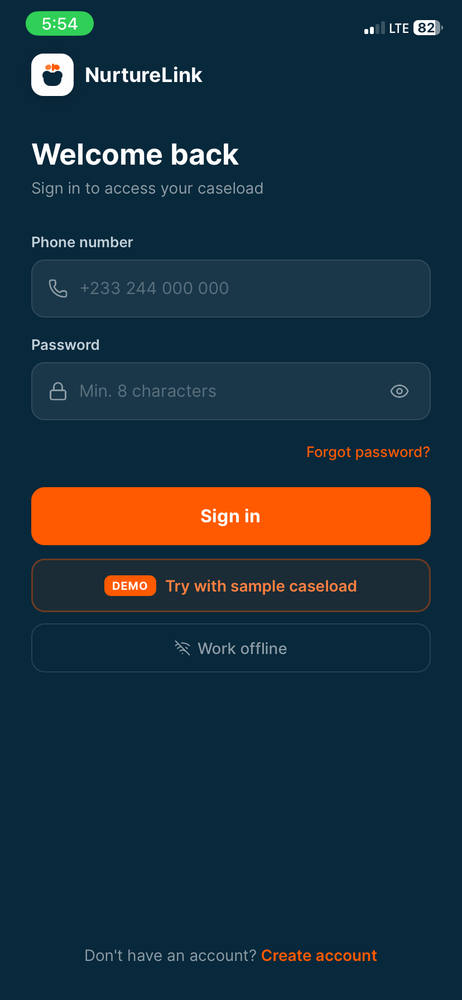 | 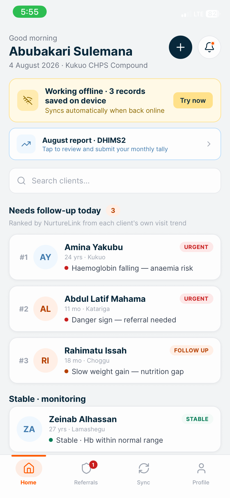 | 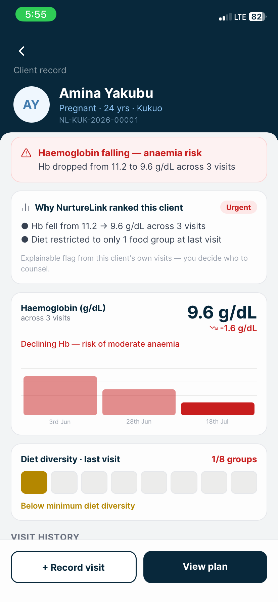 |
| **Sign in / offline mode** | **Prioritised caseload** | **Longitudinal nutrition trend** |
| 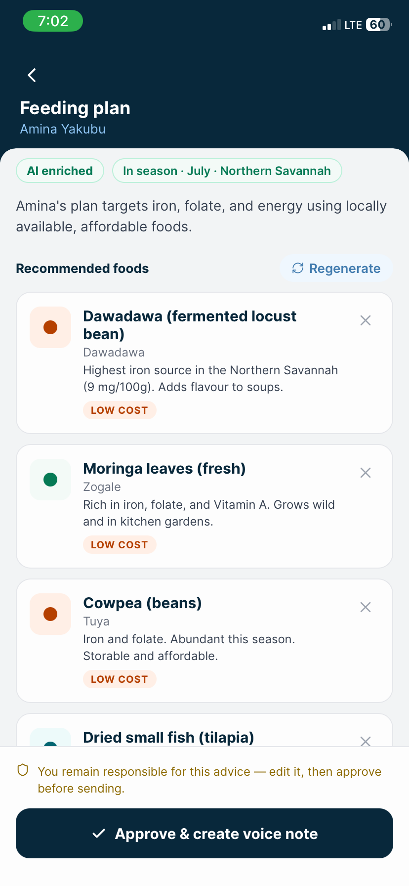 | 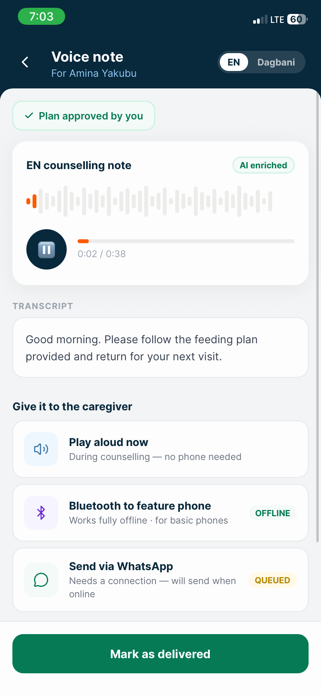 | 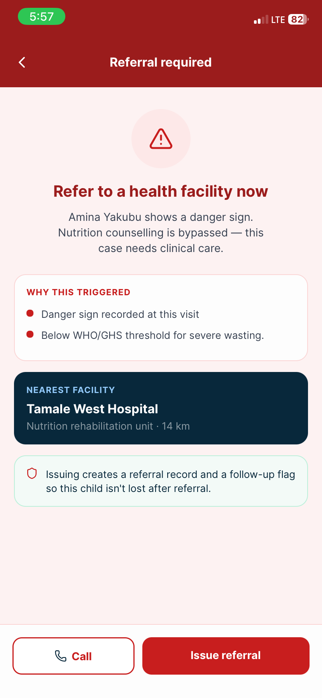 |
| **Seasonal feeding plan** | **Voice note delivery** | **Severe-case referral guardrail** |
| 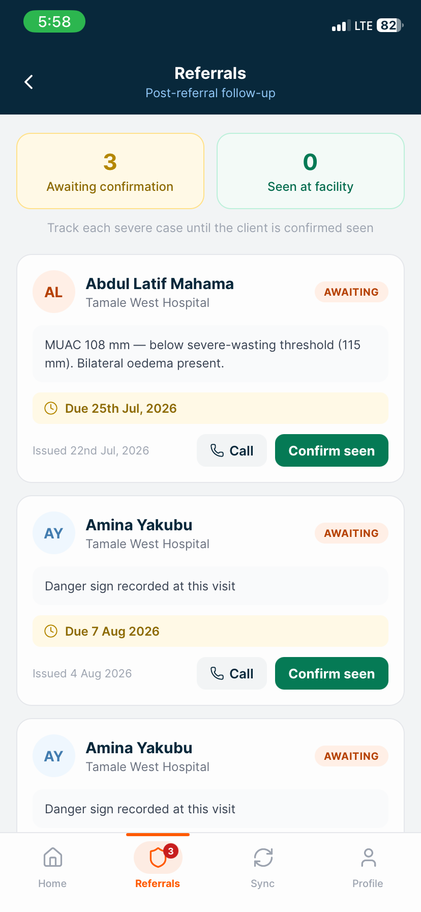 | 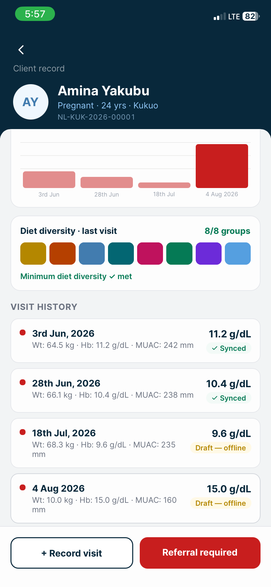 | 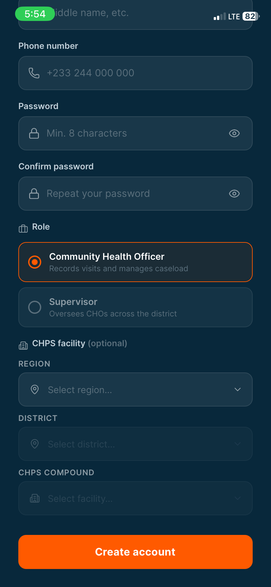 |
| **Referral tracker** | **Visit history** | **Client registration** |
| 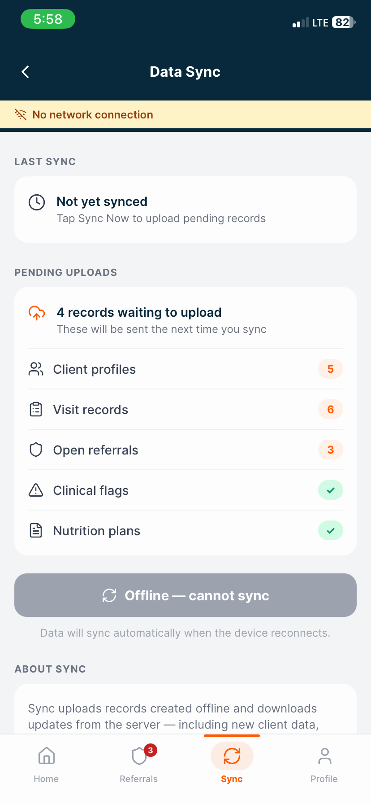 | 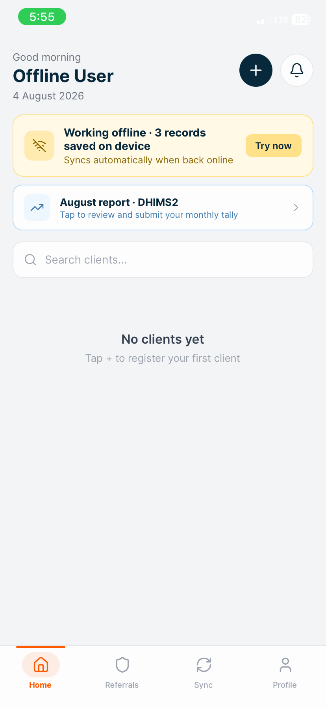 | 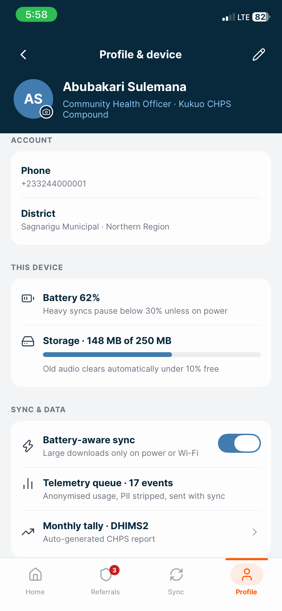 |
| **Data sync** | **Offline mode** | **Profile & device info** |

> Screenshots captured in development on iOS; production target is Android 8+, ~2 GB RAM (the actual CHO device).

---

## Table of Contents

1. [Why This Exists](#1-why-this-exists)
2. [Tech Stack](#2-tech-stack)
3. [Repository Structure](#3-repository-structure)
4. [Getting Started](#4-getting-started)
5. [Code Patterns and Conventions](#5-code-patterns-and-conventions)
6. [Architecture Invariants](#6-architecture-invariants)
7. [Domain Knowledge](#7-domain-knowledge)
8. [Clinical Protocols and Thresholds](#8-clinical-protocols-and-thresholds)
9. [Data Model](#9-data-model)
10. [Recommendation Engine](#10-recommendation-engine)
11. [Offline-First and Sync Protocol](#11-offline-first-and-sync-protocol)
12. [AI Architecture](#12-ai-architecture)
13. [Voice Delivery System](#13-voice-delivery-system)
14. [Admin Web Back-Office](#14-admin-web-back-office)
15. [DHIMS2 Interoperability](#15-dhims2-interoperability)
16. [Security and Privacy](#16-security-and-privacy)
17. [Testing Requirements](#17-testing-requirements)
18. [Non-Functional Targets](#18-non-functional-targets)
19. [Project Stage](#19-project-stage)
20. [UNICEF Challenge Area Mapping](#20-unicef-challenge-area-mapping)

---

## 1. Why This Exists

In Northern Ghana, roughly a third of children aged 6–23 months are stunted, and nationally only 26.4% of children 6–23 months receive a minimum acceptable diet (GDHS 2022), lower still in the northern regions. Children eating fewer than 4 food groups are nearly 4× more likely to be wasted. The Northern Region reported 100 institutional maternal deaths in 2023 (ratio: 136.7 per 100,000 live births) against the national SDG 3.1 target of < 70 per 100,000 by 2030, with maternal anaemia a leading and largely nutritional driver. Food insecurity in Upper East Region stands at 73.7%, the highest of the five northern regions (GDHS 2022).

The health worker currently has no tool for two critical tasks:

1. Seeing how a client's nutrition is trending across visits (not just point-in-time readings).
2. Knowing which specific foods to recommend that are nutritious, in season, affordable, and locally available today.

Generic advice ("eat more greens") fails because the right foods change by season and these are poor households who cannot act on a list of foods they cannot find or afford. This framing was confirmed with a practising Community Health Officer, whose counselling protocol organises everything around the same food-group diversity rule the engine uses.

NurtureLink adds no new measurements. It makes the data the CHO already collects actionable
---

## 2. Tech Stack

| Layer            | Choice                                        | Rationale                                                                        |
| ---------------- | --------------------------------------------- | -------------------------------------------------------------------------------- |
| Mobile           | React Native + Expo (EAS)                     | Team's existing RN/Expo expertise; TypeScript shared with backend                |
| Backend          | Express.js + TypeScript                       | Repository→Service→Route pattern; one language across stack                       |
| ORM              | Prisma                                        | Typed models, clean Postgres migrations                                          |
| Server DB        | PostgreSQL                                     | Given                                                                            |
| On-device DB     | op-sqlite (SQLCipher encryption)              | Control + simplicity; encrypted at rest                                          |
| Validation       | Zod (shared client/server)                    | End-to-end type safety                                                           |
| Object storage   | S3-compatible                                 | Voice pack audio assets                                                          |
| Admin UI         | React + Vite (or Express Admin)               | Reference data curation for district nutrition officers                         |
| AI engine (core) | On-device deterministic recommendation engine | Explainable, constraint-based decision-support AI — the product's core intelligence |
| LLM (enrichment) | Claude API (Haiku tier)                       | Bounded accessibility layer: rephrases the fixed plan into local language and parses recall; makes no clinical decision |

---

## 3. Repository Structure

```
nurturelink/
├── apps/
│   ├── mobile/              # React Native / Expo app
│   │   ├── src/
│   │   │   ├── screens/     # UI screens (Register, Visit, Plan, Referral)
│   │   │   ├── components/  # Shared UI components
│   │   │   ├── db/          # op-sqlite schema, migrations, queries
│   │   │   ├── engine/      # Deterministic recommendation engine (core IP)
│   │   │   ├── sync/        # Outbox, pull cursor, sync orchestrator
│   │   │   ├── audio/       # Voice pack assembly, playback
│   │   │   └── store/       # Local state (Zustand or Context)
│   │   ├── assets/
│   │   └── app.json
│   └── admin/               # Web back-office (React / Vite)
│       └── src/
│           ├── pages/        # Food manager, seasonal matrix, voice studio, clinical rules
│           └── api/          # Admin API client
├── packages/
│   ├── api/                 # Express.js backend
│   │   └── src/
│   │       ├── routes/      # Thin controllers: validate (Zod) → call service
│   │       ├── services/    # Business logic: sync, export, reference versioning
│   │       ├── repositories/# Prisma data access — no business logic here
│   │       ├── middleware/   # Auth (JWT), RBAC, error handling
│   │       └── lib/         # LLM proxy, DHIMS2 exporter, bundle builder
│   └── shared/              # Zod schemas, TypeScript types shared across all packages
├── prisma/
│   ├── schema.prisma
│   └── migrations/
├── docs/
│   ├── screenshots/         # App screenshots used in this README
│   └── specifications/      # Source specs — read-only reference
├── CLAUDE.md
├── SKILLS.md
└── README.md
```

---

## 4. Getting Started

```
# Install (from root — monorepo managed with pnpm workspaces)
pnpm install

# Backend
pnpm --filter api dev           # Start Express dev server
pnpm --filter api db:migrate    # Run Prisma migrations
pnpm --filter api db:seed       # Seed pilot district food/seasonal data
pnpm --filter api test          # Jest unit + integration tests

# Mobile
pnpm --filter mobile start      # Expo dev server
pnpm --filter mobile android    # Run on Android device/emulator
pnpm --filter mobile build      # EAS build (APK)

# Admin
pnpm --filter admin dev         # Vite dev server

# Shared
pnpm --filter shared build      # Compile Zod schemas and types

# Root
pnpm lint                       # ESLint across all packages
pnpm typecheck                  # tsc --noEmit across all packages
pnpm test                       # All tests
```

---

## 5. Code Patterns and Conventions

### Backend: Repository → Service → Route

```
// Route: thin. Validate input, delegate to service, return response.
router.post('/sync/push', authenticate, async (req, res) => {
  const body = SyncPushSchema.parse(req.body);   // Zod — throws on invalid
  const result = await syncService.push(body, req.user);
  res.json(result);
});

// Service: business logic. No Prisma calls directly.
class SyncService {
  constructor(private repo: SyncRepository) {}
  async push(batch: SyncPushPayload, actor: AuthUser) { ... }
}

// Repository: Prisma only. No logic, no decisions.
class SyncRepository {
  async upsertVisit(data: VisitUpsert) {
    return prisma.visit.upsert({ where: { id: data.id }, ... });
  }
}
```

### Mobile: Engine is Pure and Deterministic

The recommendation engine (`apps/mobile/src/engine/`) must be a pure function:

```
generatePlan(input: PlanInput, referenceBundle: ReferenceBundle): PlanResult | ReferralRequired
```

No side effects, no network calls, no randomness. Given the same inputs and bundle version, it always returns the same plan. This is a hard requirement for auditability.

### Shared Zod Schemas

Define all entity schemas in `packages/shared`. Import them in both `apps/mobile` and `packages/api`. Never duplicate type definitions.

### Native UI Components — Always Prefer Over Custom

Use the platform's own widgets wherever they exist. Never use a `TextInput` to collect data that has a dedicated native control.

| Use case               | Component                                   | Notes                                                                |
| ---------------------- | ------------------------------------------- | -------------------------------------------------------------------- |
| Date / time entry      | `@react-native-community/datetimepicker`    | Renders native calendar on Android/iOS; `<input type="date">` on web |
| Toggle / on-off        | `Switch` (React Native built-in)            | Use for boolean settings, not custom `View` toggles                  |
| Scroll lists           | `FlatList` / `SectionList`                  | Never render a long list inside a `ScrollView`                       |
| Alerts / confirmations | `Alert` (React Native built-in)             | Never build a custom modal for simple yes/no prompts                 |
| Loading indicator      | `ActivityIndicator` (React Native built-in) |                                                                      |

**Date picker implementation pattern:**

```
import DateTimePicker from '@react-native-community/datetimepicker';
import { Platform, Pressable } from 'react-native';
import { CalendarDays } from 'lucide-react-native';

// Android: tap button → native dialog (auto-dismisses)
// iOS:     inline spinner always visible below the field
// Web:     renders as <input type="date"> automatically

const [showPicker, setShowPicker] = useState(false);
const dateValue = isoString ? new Date(isoString) : null;

// Pressable trigger (Android / web only — iOS shows inline)
{Platform.OS !== 'ios' && (
  <Pressable style={styles.dateBtn} onPress={() => setShowPicker(true)}>
    <CalendarDays size={18} color="#9CA3AF" />
    <Text>{dateValue ? formatDate(dateValue) : 'Select date'}</Text>
  </Pressable>
)}

// Picker (always visible on iOS; toggle on Android/web)
{(showPicker || Platform.OS === 'ios') && (
  <DateTimePicker
    value={dateValue ?? new Date()}
    mode="date"
    display={Platform.OS === 'ios' ? 'spinner' : 'default'}
    maximumDate={new Date()}
    onChange={(_, date) => {
      setShowPicker(false);
      if (date) onChange(date.toISOString().slice(0, 10)); // store as YYYY-MM-DD
    }}
  />
)}
```

**Date picker rules:**

- Never use `TextInput` with `keyboardType="numeric"` for dates — use `DateTimePicker`
- Always store dates as ISO strings (`YYYY-MM-DD`) internally, format for display only
- Pass `maximumDate={new Date()}` for past dates (DOB), omit for future dates (EDD)
- For EDD / future dates, do **not** set `maximumDate`

### Icons — Non-Negotiable

All icons in the mobile app **must** use `lucide-react-native`. No exceptions.

```
// Correct
import { ChevronLeft, Bell, AlertTriangle } from 'lucide-react-native';
<ChevronLeft size={24} color="#08283B" />

// Forbidden — never do any of these
<Text>‹</Text>          // Unicode character as icon
<Text>(bell emoji)</Text>   // Emoji as icon
<Text>(warning symbol)</Text> // Symbol as icon
// Custom View-drawn icon shapes (border trick triangles, etc.)
// @expo/vector-icons or any other icon library
```

**Icon rules:**

- Import named icon components directly from `lucide-react-native`
- Always pass `size` (number, default 24) and `color` (hex string)
- No emoji characters anywhere in UI components — not even for "convenience"
- No ad-hoc icon implementations (border-trick shapes, Unicode symbols, image files used as icons)
- No other icon library (`@expo/vector-icons`, `react-native-vector-icons`, `phosphor-react-native`, etc.)

---

## 6. Architecture Invariants

**Never break these.**

1. **The core intelligence is the deterministic on-device engine; the LLM never makes clinical decisions.** The engine (flags, food selection, nutrient adequacy, referral thresholds) is explainable, constraint-based decision-support that runs on-device and is auditable. The LLM only rephrases the engine's fixed plan into natural language and parses free-text recall. If the LLM is down, care continues unchanged.

2. **The mobile app is fully functional with no network.** Every core flow — register client, record visit, compute flags, generate plan, issue referral — must work offline indefinitely. Network is an enhancement for sync and AI enrichment only.

3. **Local writes always succeed.** Never block the UI on a network call. Write to SQLite first; queue for sync via the outbox.

4. **Severe cases never receive a home-management plan.** If MUAC < 115 mm (child), Hb < 7 g/dL, or any obstetric danger sign is present, the engine must return `ReferralRequired` and block plan generation. This is a safety gate, not optional.

5. **Clinical thresholds live in reference data, not code.** They are versioned, auditable, and updatable without a code release. Never hard-code a clinical threshold as a magic number.

6. **Every plan is reproducible.** Store the `reference_bundle_version` with every plan so any plan can be recomputed from its inputs.

7. **Soft delete only.** Never hard-delete clinical data. Use `deleted_at` for all client-writable entities.

8. **No client PII is sent to the LLM.** Send the plan facts (foods, nutrients, language), never the client's name, identity, or health record.

---

## 7. Domain Knowledge

### The CHPS System

**CHPS** = Community-based Health Planning and Services. The Ghanaian primary healthcare delivery system in rural areas.

- **CHO** = Community Health Officer. The primary user. Covers a zone of scattered rural households. Carries a smartphone, frequently offline.
- **CHPS compound** = The local health post serving one zone.
- **DHIMS2** = District Health Information Management System (version 2). Ghana's national health information system.

### What the CHO Already Measures

At each client visit:

- **Weight (kg)** — plotted against WHO weight-for-age growth standards for children
- **Haemoglobin / Hb (g/dL)** — anaemia indicator for pregnant women
- **MUAC (mm)** — Mid-Upper Arm Circumference; acute malnutrition indicator for children
- **Dietary recall** — verbal account of what was eaten in the last 24–48 hours, categorised into food groups

### Key Nutrition Concepts

**Minimum Acceptable Diet (MAD):** WHO/UNICEF composite indicator for children 6–23 months. Requires meeting both minimum meal frequency and minimum dietary diversity (≥ 4 of 8 food groups).

**8 IYCF Food Groups:**

1. Grains, roots, and tubers
2. Legumes and nuts
3. Dairy products (milk, yogurt, cheese)
4. Flesh foods (meat, fish, poultry, organ meats)
5. Eggs
6. Vitamin A–rich fruits and vegetables
7. Other fruits and vegetables
8. Breastmilk (for children < 24 months)

**Diet Diversity Score (DDS):** count of distinct food groups consumed. Target: ≥ 4 for MAD.

**Nutrient Gaps (common in Northern Ghana):**

- Pregnant women: iron (anaemia), folate (neural tube), energy
- Children 6–23 months: iron, vitamin A, zinc, protein, energy (diet diversity)
- Children 24–59 months: iron, protein, energy

**Affordability:** Modelled as tiers (`staple_cheap` | `market` | `premium`), never as currency amounts. Seasonal availability is the real constraint.

### CHO Daily Workflow

| Time         | CHO Action                 | NurtureLink                                                  |
| ------------ | -------------------------- | ------------------------------------------------------------ |
| Start of day | Review today's visit list  | Pre-sorted priority list by risk score                       |
| At household | Greet, take measurements   | < 60 sec data entry (numeric fields + tap-selectors)         |
| During visit | Counsel on nutrition       | View flags, generate plan, review rationale                  |
| Play/share   | Hand guidance to caregiver | Play local-language voice note, or share via WhatsApp/Xender |
| Severe case  | Route to referral          | Referral guardrail blocks counselling, prompts referral      |
| End of month | Submit DHIMS2 tally        | Auto-generated tally summary from digital entries            |

### Voice Asset Transfer to Caregivers

The caregiver often has a feature phone and is low-literacy. Three transfer methods today:

1. **In-person playback** (primary): CHO plays the voice note through the phone speaker during the visit.
2. **Bluetooth push** (offline): direct device-to-device transfer for feature phones.
3. **WhatsApp/Xender share** (online/peer-to-peer): share the audio file if the caregiver has a smartphone.

No app or data connection required on the caregiver's device. A direct IVR channel is on the roadmap (see §13).

---

## 8. Clinical Protocols and Thresholds

All thresholds are sourced from WHO/IYCF/GHS references and stored in the `clinical_thresholds` reference table — never hard-coded.

### Severity Classification

**For children (MUAC):**

| MUAC       | Severity       | Action                               |
| ---------- | -------------- | ------------------------------------ |
| ≥ 125 mm   | OK / Green     | Proceed to counselling               |
| 115–124 mm | Watch / Yellow | Flag; counsel with extra emphasis    |
| < 115 mm   | Severe / Red   | **Referral required — no home plan** |

**For pregnant women (Hb):**

| Hb (g/dL) | Severity       | Action                               |
| --------- | -------------- | ------------------------------------ |
| ≥ 11.0    | OK / Green     | Proceed to counselling               |
| 8.0–10.9  | Watch / Yellow | Flag; iron/folate emphasis           |
| 7.0–7.9   | Moderate       | Flag; counsel + reinforce supplement |
| < 7.0     | Severe / Red   | **Referral required — no home plan** |

**Obstetric danger signs** (any present → referral required):

- Severe headache or visual disturbance
- Severe abdominal pain
- Heavy vaginal bleeding
- Convulsions / loss of consciousness
- Difficulty breathing at rest
- Baby not moving (third trimester)

**Weight-for-age (children):**

| Z-score     | Classification                  |
| ----------- | ------------------------------- |
| ≥ −1 SD     | Normal                          |
| −2 to −1 SD | Watch                           |
| −3 to −2 SD | Moderately underweight          |
| < −3 SD     | Severely underweight — referral |

### Prioritisation Flags

| Flag             | Signal                                                      |
| ---------------- | ----------------------------------------------------------- |
| `FALLING_HB`     | Hb decreased by ≥ 0.5 g/dL vs. previous visit               |
| `FLAT_WEIGHT`    | Weight gain < expected trajectory for 2+ consecutive visits |
| `LOW_DIVERSITY`  | DDS < 4 in latest dietary recall                            |
| `DANGER_SIGNS`   | Any obstetric danger sign present                           |
| `SEVERE_MUAC`    | MUAC < 115 mm                                               |
| `SEVERE_ANAEMIA` | Hb < 7.0 g/dL                                               |

### Nutrient Targets (WHO/IYCF)

| Profile      | Nutrient  | Daily Target |
| ------------ | --------- | ------------ |
| Pregnant     | Iron      | 27 mg        |
| Pregnant     | Folate    | 600 µg DFE   |
| Pregnant     | Energy    | 2340 kcal    |
| Child 6–23m  | Iron      | 11 mg        |
| Child 6–23m  | Vitamin A | 400 µg RAE   |
| Child 6–23m  | Zinc      | 3 mg         |
| Child 6–23m  | Protein   | 13 g         |
| Child 24–59m | Iron      | 7 mg         |
| Child 24–59m | Protein   | 19 g         |
| Child 24–59m | Energy    | 1350 kcal    |

---

## 9. Data Model

### Core Tables (server + device)

`users`, `facilities`, `households`, `clients`, `visits`, `flags`, `plans`, `referrals`

### Reference Tables (read-only on device, managed via Admin)

`foods`, `seasonal_availability`, `agro_zones`, `nutrient_targets`, `voice_packs`, `clinical_thresholds`, `reference_bundles`

### Sync Tables (device)

`outbox`, `sync_state`

### Operational Tables (server)

`audit_log`, `telemetry_events`

All client-writable rows carry: `id UUID (client-generated)`, `updated_at`, `deleted_at`, `synced_at`.

### PostgreSQL Schema

```sql
-- USERS
CREATE TABLE users (
    id UUID PRIMARY KEY,
    name TEXT NOT NULL,
    role TEXT CHECK (role IN ('system_admin', 'district_admin', 'CHO', 'nutrition_officer', 'supervisor')) NOT NULL,
    facility_id UUID REFERENCES facilities(id),
    phone TEXT UNIQUE NOT NULL,
    password_hash TEXT NOT NULL,
    active BOOLEAN DEFAULT TRUE,
    created_at TIMESTAMPTZ DEFAULT NOW(),
    updated_at TIMESTAMPTZ NOT NULL
);

-- FACILITIES (CHPS compounds / zones)
CREATE TABLE facilities (
    id UUID PRIMARY KEY,
    name TEXT NOT NULL,
    district TEXT NOT NULL,
    region TEXT NOT NULL,
    agro_zone_id UUID REFERENCES agro_zones(id),
    geo JSONB,          -- { lat, lng }
    active BOOLEAN DEFAULT TRUE
);

-- HOUSEHOLDS
CREATE TABLE households (
    id UUID PRIMARY KEY,
    facility_id UUID NOT NULL REFERENCES facilities(id),
    label TEXT NOT NULL,
    community TEXT NOT NULL,
    geo JSONB,
    notes TEXT,
    updated_at TIMESTAMPTZ NOT NULL,
    deleted_at TIMESTAMPTZ
);

-- CLIENTS (mothers or children)
CREATE TABLE clients (
    id UUID PRIMARY KEY,
    household_id UUID NOT NULL REFERENCES households(id),
    type TEXT CHECK (type IN ('pregnant', 'child')) NOT NULL,
    name TEXT NOT NULL,
    dob DATE,                -- children
    edd_gestation TEXT,      -- pregnant: estimated due date or gestation weeks
    sex TEXT CHECK (sex IN ('M', 'F', 'unknown')),
    consent_at TIMESTAMPTZ NOT NULL,
    active BOOLEAN DEFAULT TRUE,
    updated_at TIMESTAMPTZ NOT NULL,
    deleted_at TIMESTAMPTZ,
    synced_at TIMESTAMPTZ
);

-- VISITS (append-only clinical record)
CREATE TABLE visits (
    id UUID PRIMARY KEY,
    client_id UUID NOT NULL REFERENCES clients(id),
    user_id UUID NOT NULL REFERENCES users(id),
    visited_at TIMESTAMPTZ NOT NULL,
    weight_kg NUMERIC(4,2),
    hb_g_dl NUMERIC(3,1),       -- mothers only
    muac_mm NUMERIC(4,1),       -- children only
    diet_recall JSONB NOT NULL,  -- ["grains", "legumes", "eggs", ...]
    danger_signs JSONB,
    notes TEXT,
    updated_at TIMESTAMPTZ NOT NULL,
    deleted_at TIMESTAMPTZ,
    synced_at TIMESTAMPTZ
);

-- FLAGS (derived, computed after each visit)
CREATE TABLE flags (
    id UUID PRIMARY KEY,
    client_id UUID NOT NULL REFERENCES clients(id),
    visit_id UUID NOT NULL REFERENCES visits(id),
    severity TEXT CHECK (severity IN ('ok', 'watch', 'refer')) NOT NULL,
    reasons JSONB NOT NULL,
    computed_at TIMESTAMPTZ NOT NULL,
    reference_bundle_version TEXT NOT NULL
);

-- PLANS (generated feeding plans)
CREATE TABLE plans (
    id UUID PRIMARY KEY,
    client_id UUID NOT NULL REFERENCES clients(id),
    visit_id UUID NOT NULL REFERENCES visits(id),
    season_month INTEGER NOT NULL,
    district TEXT NOT NULL,
    target_nutrients JSONB NOT NULL,
    foods JSONB NOT NULL,
    adequacy JSONB NOT NULL,
    rationale JSONB NOT NULL,
    voice_script TEXT,
    voice_pack_id UUID REFERENCES voice_packs(id),
    ai_enriched BOOLEAN DEFAULT FALSE,
    reference_bundle_version TEXT NOT NULL,
    created_by UUID NOT NULL REFERENCES users(id),
    created_at TIMESTAMPTZ NOT NULL
);

-- REFERRALS
CREATE TABLE referrals (
    id UUID PRIMARY KEY,
    client_id UUID NOT NULL REFERENCES clients(id),
    visit_id UUID NOT NULL REFERENCES visits(id),
    reason TEXT NOT NULL,
    flag_codes JSONB NOT NULL,
    facility_to TEXT,
    status TEXT CHECK (status IN ('issued', 'in_transit', 'arrived', 'outcome_good', 'outcome_poor', 'lost_to_follow_up')) DEFAULT 'issued',
    queued_offline BOOLEAN DEFAULT TRUE,
    issued_at TIMESTAMPTZ NOT NULL,
    updated_at TIMESTAMPTZ NOT NULL,
    synced_at TIMESTAMPTZ
);
```

### Reference Tables Schema

```sql
-- AGRO ZONES
CREATE TABLE agro_zones (
    id UUID PRIMARY KEY,
    name TEXT NOT NULL,
    districts JSONB NOT NULL
);

-- FOODS
CREATE TABLE foods (
    id UUID PRIMARY KEY,
    name TEXT NOT NULL,
    local_names JSONB NOT NULL,  -- { "dagbani": "zogale", "mampruli": "..." }
    food_group TEXT NOT NULL,
    nutrients JSONB NOT NULL,    -- per standard serving: { iron_mg, folate_ug, protein_g, energy_kcal, vit_a_ug_rae, zinc_mg }
    affordability_tier TEXT CHECK (affordability_tier IN ('staple_cheap', 'market', 'premium')) NOT NULL,
    storable BOOLEAN DEFAULT FALSE,
    garden_wild BOOLEAN DEFAULT FALSE,
    active BOOLEAN DEFAULT TRUE
);

-- SEASONAL AVAILABILITY
CREATE TABLE seasonal_availability (
    id UUID PRIMARY KEY,
    agro_zone_id UUID NOT NULL REFERENCES agro_zones(id),
    month INTEGER CHECK (month BETWEEN 1 AND 12) NOT NULL,
    food_id UUID NOT NULL REFERENCES foods(id),
    availability TEXT CHECK (availability IN ('abundant', 'available', 'scarce')) NOT NULL,
    updated_at TIMESTAMPTZ DEFAULT NOW(),
    UNIQUE (agro_zone_id, month, food_id)
);

-- CLINICAL THRESHOLDS (sourced from WHO/GHS — never hard-coded in app logic)
CREATE TABLE clinical_thresholds (
    id UUID PRIMARY KEY,
    metric TEXT NOT NULL,
    condition TEXT NOT NULL,
    severity TEXT CHECK (severity IN ('ok', 'watch', 'moderate', 'refer')) NOT NULL,
    threshold_value NUMERIC,
    threshold_direction TEXT CHECK (threshold_direction IN ('lt', 'lte', 'gte', 'gt')),
    source TEXT NOT NULL
);

-- VOICE PACKS
CREATE TABLE voice_packs (
    id UUID PRIMARY KEY,
    language TEXT NOT NULL,
    version TEXT NOT NULL,
    phrases JSONB NOT NULL,
    template_map JSONB NOT NULL,
    bundle_url TEXT,
    active BOOLEAN DEFAULT TRUE
);

-- REFERENCE BUNDLES
CREATE TABLE reference_bundles (
    id UUID PRIMARY KEY,
    version_tag TEXT UNIQUE NOT NULL,
    description TEXT,
    tables_included JSONB NOT NULL,
    published_by UUID REFERENCES users(id),
    published_at TIMESTAMPTZ DEFAULT NOW(),
    checksum TEXT NOT NULL,
    active BOOLEAN DEFAULT TRUE
);
```

### On-Device Only (SQLite)

```sql
-- OUTBOX (pending mutations, cleared on successful push)
CREATE TABLE outbox (
    id INTEGER PRIMARY KEY AUTOINCREMENT,
    idempotency_key TEXT UNIQUE NOT NULL,
    entity_type TEXT NOT NULL,
    entity_id TEXT NOT NULL,
    operation TEXT CHECK (operation IN ('insert', 'update', 'delete')) NOT NULL,
    payload TEXT NOT NULL,
    created_at INTEGER NOT NULL
);

-- SYNC STATE (pull cursor per table)
CREATE TABLE sync_state (
    table_name TEXT PRIMARY KEY,
    last_cursor TEXT NOT NULL,
    updated_at INTEGER NOT NULL
);

-- TELEMETRY EVENTS (anonymised, flushed on sync)
CREATE TABLE telemetry_events (
    id TEXT PRIMARY KEY,
    event_type TEXT NOT NULL,  -- PLAN_GENERATED | VOICE_NOTE_PLAYED | REFERRAL_ISSUED | VISIT_DURATION_SEC
    payload TEXT,              -- JSON, no PII
    created_at INTEGER NOT NULL,
    synced_at INTEGER
);
```

---

## 10. Recommendation Engine

The core AI of the product, and its core IP. Runs entirely on-device, is deterministic, and produces reproducible results from the same inputs. Matching a nutrient gap to the right foods under seasonal, availability, and affordability constraints is a constraint-satisfaction and optimisation problem; solving it transparently is what makes this explainable decision-support AI rather than a black box.

### Function Signature

```
interface PlanInput {
  clientType: 'pregnant' | 'child';
  ageMonths?: number;
  gestationWeeks?: number;
  flags: Flag[];
  agroZoneId: string;
  currentMonth: number;         // 1–12
  affordabilityCeiling: 'staple_cheap' | 'market' | 'premium';  // default: staple_cheap
}

type EngineResult = PlanResult | ReferralRequired;

interface ReferralRequired {
  kind: 'referral';
  triggeringFlags: Flag[];
  message: string;
}

interface PlanResult {
  kind: 'plan';
  targetNutrients: string[];
  selectedFoods: SelectedFood[];
  adequacy: Record<string, number>;  // nutrient → fraction of daily target (0–1)
  rationale: RationaleEntry[];
  voiceScriptTemplate: string;
  referenceBundleVersion: string;
}
```

### Step-by-Step Algorithm

**Step 0: Referral guardrail (hard stop)**

Before any computation, check `clinical_thresholds` for severe flags:

- MUAC < 115 mm → `ReferralRequired`
- Hb < 7.0 g/dL → `ReferralRequired`
- Any `DANGER_SIGNS` flag present → `ReferralRequired`

If any severe condition is met, return `ReferralRequired` immediately. Do not proceed.

**Step 1: Determine nutrient profile**

```
pregnant             → profile: 'pregnant'    → { iron: 27mg, folate: 600µg, energy: 2340kcal }
child, 6–23 months  → profile: 'child_6_23m' → { iron: 11mg, vit_a: 400µg, zinc: 3mg, protein: 13g }
child, 24–59 months → profile: 'child_24_59m'→ { iron: 7mg, protein: 19g, energy: 1350kcal }
```

**Step 2: Identify active nutrient gaps**

From the flags:

- `FALLING_HB` or anaemia watch → iron, folate (pregnant); iron (children)
- `FLAT_WEIGHT` → energy, protein
- `LOW_DIVERSITY` → all food groups; prioritise missing groups from diet recall
- No flag → default to all nutrients for the profile (preventive plan)

**Step 3: Build candidate food set**

Filter `foods` to items where ALL of:

- `affordability_tier` ≤ `affordabilityCeiling`
- AND at least one of:
  - `seasonal_availability` for (`agroZoneId`, `currentMonth`) is `abundant` or `available`
  - OR `storable = TRUE`
  - OR `garden_wild = TRUE`
- AND `active = TRUE`

**Step 4: Score and select basket**

Goal: select 5–6 foods that maximise nutrient gap coverage with minimum cost and variety.

Greedy selection:

1. For each active nutrient gap, score all candidate foods by: `nutrient_value / affordability_cost_band_rank`
2. Pick the highest-scoring food for the primary gap not yet covered
3. Add to basket. Recompute which gaps remain
4. Repeat until 5–6 items selected or all gaps covered
5. Prefer diversity: if two foods provide similar gap coverage, prefer different food groups
6. Prefer `abundant` over `available` over `storable` over `garden_wild` (freshness heuristic)

**Step 5: Compute adequacy**

```
adequacy[nutrient] = sum(food.nutrients[nutrient] × typical_serving) / daily_target
```

Report as a fraction (0–1). The UI renders this as a percentage.

**Step 6: Build rationale**

For each selected food, record which constraints drove its selection:

```
{
  "food_id": "uuid",
  "reasons": ["in_season_abundant", "closes_iron_gap", "storable", "affordability_staple_cheap"]
}
```

**Step 7: Assemble script template**

```
"For [client_name]'s health, eat these foods this week: [food1_local_name], [food2_local_name], [food3_local_name].
These foods are available and affordable now. They help with [primary_gap_plain_language].
Remember to take your iron-folate supplement every day."
```

This is the fallback voice script. AI enrichment replaces it with a warmer version when online.

---

## 11. Offline-First and Sync Protocol

### On-Device Architecture

- **SQLite (op-sqlite + SQLCipher):** encrypted database file. All clinical data lives here first.
- **Outbox table:** every local write is added to the outbox with an idempotency key (UUID v4).
- **Sync state table:** stores the last successful pull cursor per table.
- **Reference bundles:** stored as JSON files on the device filesystem, versioned.

### Push Flow (device → server)

```
1. Collect all outbox rows (ordered by created_at)
2. POST /sync/push { mutations: [...] }
3. Server upserts each by entity UUID (idempotent — safe to retry)
4. Server sets authoritative updated_at, writes to audit_log
5. Server responds: { accepted: [idempotency_key...], errors: [...] }
6. Device removes accepted rows from outbox
7. On error or network failure: keep in outbox, retry on next sync
```

### Pull Flow (server → device)

```
1. GET /sync/pull?since=<cursor>&tables=clients,visits,flags,plans,referrals
2. Server returns rows changed (or soft-deleted) since cursor for each table
3. Device applies changes (upsert by UUID; mark local rows as deleted_at if server sends deleted_at)
4. Device advances cursor ONLY if all tables applied without error
5. On partial failure: do not advance cursor; retry full pull
```

### Reference Bundle Flow

```
1. GET /reference/manifest → { bundles: [{ name, current_version, checksum }] }
2. Compare to local bundle versions in sync_state
3. For each out-of-date bundle: GET /reference/:bundle/:version (gzipped JSON)
4. Verify checksum; replace local file atomically
5. Re-index SQLite from new bundle
```

### Conflict Resolution

| Entity                  | Strategy                                                               |
| ----------------------- | ---------------------------------------------------------------------- |
| `visits`                | Append-only. No true conflicts.                                        |
| `client` profile fields | Last-write-wins by server `updated_at`.                                |
| `referral` status       | Surface conflict flag for worker resolution. Never silently overwrite. |
| `plans`, `flags`        | Derived — can be recomputed. Safe to overwrite.                        |

### Sync Trigger Events

- App comes to foreground (after ≥ 5 min background)
- Network state changes to connected
- Background task (every 15 min when connected)
- Immediately after recording a referral (emergency push)
- Heavy bundle downloads: only when battery > 30% OR charging

---

## 12. AI Architecture

NurtureLink's intelligence lives in two layers, kept deliberately apart. The split is what makes the system both genuinely AI-driven and safe.

### Layer 1 — The decision-support engine (the core AI)

The intelligence at the heart of the product is the recommendation engine. Matching a client's specific nutrient gap to the right foods, under the real-world constraints of what is in season, affordable, and locally available this month, is a constraint-satisfaction and optimisation problem. The engine solves it deterministically against a curated knowledge base of WHO/IYCF nutrient targets, food composition, and per-district seasonal availability.

This is explainable, knowledge-based decision-support AI, built for a safety-critical, low-trust setting. Its determinism is a feature, not a limitation: every recommendation is auditable, reproducible from its inputs and reference-bundle version, and carries a plain-language rationale the health worker can see. It runs fully on-device, so the intelligence is available with no connectivity at all. See §10 for the full algorithm.

We deliberately keep generative models out of the clinical decision path, because a food or dosage recommendation must be traceable to a reference, never invented.

### Layer 2 — The LLM enrichment layer (bounded, optional)

A large language model (Claude Haiku) sits on top as an accessibility layer. It decides nothing clinical. Its only jobs are to rephrase the engine's already-fixed plan into warm, natural local language for the caregiver, and optionally to parse a free-text dietary recall into food groups. It runs server-side when online, its output is validated against the deterministic plan before use, and if it is unavailable a template produces a functional version of the same plan, so care never depends on it.

### How the two layers fit together

```
CLINICAL CORE (device, deterministic, always available)
  visit data  ──► flags/prioritisation  ─┐
                                          ├──► PLAN (fixed foods + fixed clinical facts)
  reference bundle ──► food selection  ──┘          │
                                                     │ (when online)
                                                     ▼
                                        AI ENRICHMENT (server-side, optional)
                                          LLM: rephrase facts into
                                          warm local-language script ──► cache to device

free-text recall ─(online)─► LLM: parse ──► food groups ──► diet-diversity input
                 └─(offline)─► manual food-group tap-select (fallback)
```

The engine decides; the LLM only formats and parses.

### Flow 1 — Counselling Script Generation

**Purpose:** turn the deterministic plan into a warm, culturally appropriate caregiver script ready for voice.

**Trigger:** plan generated and device is online.

**Where it runs:** backend proxies to the Claude API. Keys never touch the device.

**Input to LLM:**

```
{
  "client": { "type": "pregnant", "gestation_weeks": 30 },
  "language": "dagbani",
  "target_nutrients": ["iron", "folate"],
  "foods": [
    { "name": "zogale leaves", "local": "zogale", "why": "in season, iron+folate" },
    { "name": "dried small fish", "local": "amani", "why": "storable, iron+protein" },
    { "name": "cowpea", "local": "tuya", "why": "storable, protein+folate" }
  ],
  "clinical_note": "reinforce daily iron-folate supplement"
}
```

**System prompt (essence):**

```
You are a nutrition counselling translator. Rephrase ONLY the facts provided into a short,
warm, plain caregiver message in the target language. Do not add any food, quantity, dosage,
or medical claim not present in the input. Return JSON: { "script": "..." }. No prose, no code
fences, no explanation.
```

**Output validation (non-negotiable):**

- Parse JSON; reject if malformed
- Check every food name in the script is present in the input foods list
- Check no numeric value appears in the script that is not in the input
- On validation failure: discard, fall back to the template script
- Log: input hash, model, version, output hash, validation_passed

**Caching:** cache by plan signature = hash(client_profile + food_ids + language + bundle_version).

**Offline fallback:** the engine's template script. The AI script replaces it on next sync.

### Flow 2 — Dietary Recall Parsing (Could-Have)

**Input:** `"She ate tuo zaafi with groundnut soup and a boiled egg for breakfast, and rice in the evening."`

**Output:** `{ "food_groups": ["grains", "legumes_nuts", "eggs"] }`

The worker confirms the output before it counts toward the DDS. Manual tap-select is the default fallback.

### Responsible AI Controls

| Control              | Implementation                                                                |
| -------------------- | ----------------------------------------------------------------------------- |
| Core is explainable  | Clinical decisions come from the deterministic engine, reproducible from inputs + bundle version |
| No PII to LLM        | Send plan facts only; no client name, ID, or health record                    |
| Output validation    | Check foods + claims against the deterministic plan before use                |
| Fallback             | Template always available; the LLM is enhancement only                        |
| Audit log            | Every LLM call: input hash, model, version, output hash, validation result    |
| Human review         | Worker reviews every plan and script before the caregiver sees it             |
| Severe-case bypass   | MUAC < 115, Hb < 7, or any danger sign routes to referral without touching the LLM |

**Model:** Claude Haiku. API keys server-side only, never shipped to the device.

### Responsible AI Checklist

Before any AI feature ships:

- [ ] Clinical decision made by the deterministic engine, not the LLM
- [ ] LLM output validated against the deterministic plan before use
- [ ] Fallback to template on validation failure or LLM unavailability
- [ ] No PII sent to the LLM
- [ ] Every LLM call logged with input, model, version, and output hash
- [ ] Human worker reviews every plan before it reaches a caregiver
- [ ] Severe-case guardrail bypasses the LLM entirely

---

## 13. Voice Delivery System

### Approach

**Pre-recorded human voice** (not TTS). A native-speaking health worker records a fixed phrase set. This is safer than TTS for clinical messages in low-resource languages where TTS quality is unreliable.

### Phrase Architecture

A voice pack contains:

- **Named audio clips** for: each food's local name, standard counselling phrases (greetings, "eat this food", "every day", "remember your supplement", "go to the health facility immediately"), and connecting words.
- **Template map:** a JSON structure mapping plan fields to an ordered sequence of phrase keys.

Example template map:

```
{
  "pregnant_plan": [
    "greeting",
    "counselling_intro",
    { "repeat": "food_name:{food_id}" },
    "supplement_reminder",
    "closing"
  ]
}
```

The app assembles clips in order → a single `.aac` audio file per plan.

### Bundle Delivery

- Voice packs stored in object storage as versioned ZIP bundles
- Only download the pack for the device's assigned district and language
- Audio: AAC-HE or Opus, 32 kbps mono, < 15 MB per full language pack

### Playback and Sharing

```
// Playback
Audio.Sound.createAsync({ uri: plan.assembledAudioUri });

// Share
Share.share({ url: plan.assembledAudioUri, message: 'NurtureLink nutrition plan' });
```

### Between-Visit Reach (Future Work)

Today the caregiver receives the plan through the CHO's phone (in-person playback, Bluetooth push, or WhatsApp/Xender share). On the roadmap, the same voice plan extends to an **IVR (interactive voice response)** line: a caregiver on any basic feature phone can receive the plan and reminders as a call in her own language, with no app and no data, and respond by keypad. This reuses the voice content the engine already produces, so it is a delivery step, not a redesign.

### Language Expansion

Dagbani first (pilot district). Engineering scaffolding is language-agnostic.

Planned: Mampruli, Gonja, Gurune, Dagaare, Kusaal, Hausa.

---

## 14. Admin Web Back-Office

### Roles

| Role             | Permissions                                                              |
| ---------------- | ------------------------------------------------------------------------ |
| `system_admin`   | User provisioning, facility mappings, system parameters, publish bundles |
| `district_admin` | Food composition CRUD, seasonal calendar, audio uploads, DHIMS2 export   |

### Modules

**Food Composition Manager**

- Bulk CSV/Excel upload with validation
- Visual table editor for in-place edits

**Seasonal Matrix Scheduler**

- Interactive grid: rows = foods, columns = months 1–12
- Filter by agro-zone
- Changes staged until admin publishes a new bundle

**Voice Pack Audio Studio**

- Upload `.mp3`/`.aac` audio files tagged with a phrase key
- Preview playback in browser
- Auto-packages into compressed ZIP bundle on publish

**Clinical Rules Governance Console**

- View current thresholds with WHO/GHS source citations
- Propose update: fill new value + justification
- Requires a second admin to sign off before the updated bundle is published
- Full change log

**Reference Bundle Publisher**

- Shows current vs. staged changes across all reference tables
- One-click publish: generates version tag (e.g., `v1.4-2026-08`), computes checksum
- Makes available at `/reference/manifest`

**DHIMS2 Export**

- Select facility + reporting period → generate CHPS tally summary
- Download as CSV or dispatch as DHIMS2-compatible payload

---

## 15. DHIMS2 Interoperability

NurtureLink complements DHIMS2; it does not replace or duplicate it.

### MVP Export

- Aggregate indicators per facility per reporting period
- Format: CSV matching national CHPS tally sheet columns
- Available via Admin back-office

### API Endpoint

```
POST /export/dhims2
Body: { facility_id, period_start, period_end }
Response: { format: "csv", data: "...", metadata: { ... } }
```

---

## 16. Security and Privacy

**Legal basis:** Ghana Data Protection Act, 2012 (Act 843).

### On-Device

- SQLite encrypted with SQLCipher (AES-256). Key derived from user PIN/password.
- Multi-worker device sharing: each user logs in with their own PIN
- App lock on background (configurable timeout)
- Data scoped to the worker's facility only

### In Transit

- TLS 1.2+ for all API calls. Certificate pinning for the mobile app.
- JWT access tokens (short-lived: 15 min) + refresh tokens (7 days, httpOnly cookie on admin web)
- No API keys on the device

### At Rest (Server)

- Encrypted volumes for Postgres and object storage
- Least-privilege DB roles
- Audit log captures every write: user, entity, action, timestamp, change summary

### Authentication Flow

```
POST /auth/login  { phone, password }
  → verify password_hash (bcrypt)
  → return { access_token (JWT 15min), refresh_token (opaque, stored server-side) }

POST /auth/refresh  { refresh_token }
  → validate, rotate refresh token
  → return new access_token

All protected routes → authenticate middleware → verify JWT signature + expiry → attach user to req
RBAC middleware → check role against route permission map
```

### Data Minimisation

- Collect only what CHPS already records
- Affordability stored as tier (not financial detail)
- Only plan facts (not client identity) sent to LLM

### Consent

- Capture client consent at registration (`consent_at` field)
- Withdrawal: soft-delete (`deleted_at`) + schedule data purge on next sync

---

## 17. Testing Requirements

- **Recommendation engine:** golden-file tests covering every nutrient-gap profile × season × affordability tier × severe case. Determinism test: same input must always produce same output.
- **Sync:** round-trip tests — offline-created records push and pull correctly, idempotency on retry, cursor advances correctly, conflict flags surface.
- **Referral guardrail:** test every severe threshold combination; assert engine returns `ReferralRequired`, not a plan.
- **Clinical validation (non-automated):** a health teammate (nutrition officer or UDS contact) must review all thresholds and sample plans against WHO/GHS guidance before any field use. This is a safety gate.
- **Device:** test on at least one genuine low-end Android device (Android 8+, ~2 GB RAM).

---

## 18. Non-Functional Targets

| Metric                    | Target                                                           |
| ------------------------- | ---------------------------------------------------------------- |
| Target device             | Android 8+, ~2 GB RAM                                            |
| APK size                  | < 30 MB                                                          |
| Voice packs               | < 15 MB per language                                             |
| On-device storage cap     | 250 MB total                                                     |
| Recommendation generation | < 1 s on-device                                                  |
| App cold start            | < 3 s                                                            |
| Priority list load        | < 500 ms (from local SQLite)                                     |
| Client visit screen load  | < 300 ms                                                         |
| Voice note assembly       | < 2 s                                                            |
| Audio encoding            | AAC-HE or Opus, 32 kbps mono                                     |
| Accessibility             | Large tap targets (≥ 48 dp), sun-readable contrast, voice output |

Auto-clear synced audio cache when device storage drops below 10% free.

### Battery Awareness

| Sync Type                 | Battery Condition                          |
| ------------------------- | ------------------------------------------ |
| Emergency push (referral) | Always — lightweight JSON payload          |
| Standard push/pull        | Any — small payload                        |
| Reference bundle download | Battery > 30% OR charging                  |
| Voice pack download       | Battery > 30% OR charging + WiFi preferred |

---

## 19. Project Stage

NurtureLink was developed for the UNICEF AI for Nurturing Care Hackathon in August 2026 and is preserved here as a research and product prototype. The repository demonstrates the proposed offline-first architecture, decision-support workflow, interfaces, data model, safety guardrails, and implementation approach.

Before clinical or operational deployment, the project requires:

- formal review of clinical thresholds and recommendation rules by qualified Ghana Health Service and nutrition professionals;
- validation of local food, seasonality, affordability, and language data in the intended pilot district;
- end-to-end device, synchronisation, privacy, and security testing;
- usability testing with Community Health Officers and caregivers;
- governance and approval for DHIMS2 interoperability and any production AI service.

The prototype should not be used as a substitute for professional clinical judgement or an approved health-information system.

---

## 20. UNICEF Challenge Area Mapping

| # | Challenge Area                    | NurtureLink                                                                                                         | Depth              |
| - | --------------------------------- | ------------------------------------------------------------------------------------------------------------------- | ------------------ |
| 1 | Predicting risk before crisis     | Priority list ranked by each client's own visit trend (falling Hb, flat weight-for-age, low DDS, danger signs)      | Touched (solid)    |
| 2 | Last-mile follow-up               | Severe cases route to referral guardrail; post-referral tracking deferred to roadmap                                | Deferred (roadmap) |
| 3 | Local-food nutrition intelligence | Core product: seasonal, affordable, locally available feeding plan matched to nutrient gap with longitudinal record | Core (deep)        |
| 4 | Voice-first caregiver support     | Plan delivered as local-language voice note the caregiver keeps on any phone                                        | Core (channel)     |
| 5 | Smarter CHPS workflows            | Offline visit capture, auto-computed trends and flags, DHIMS2-compatible tally export                               | Touched (solid)    |
| 6 | Hidden barriers to care           | Accounts for seasonal and affordability access barriers; socio-cultural barriers deferred                           | Lightly touched    |

### Pitch Framing

Lead with **Challenge 3** (local-food nutrition intelligence) as the one deep problem. Name **Challenge 4** (voice-first) as the delivery channel. Note that **Challenges 1 and 5** come along naturally from the same visit data. State plainly that last-mile tracking (2) and wider care-seeking barriers (6) are deliberately on the roadmap — this signals engineering discipline and matches what evaluators reward. Do not claim all six.
